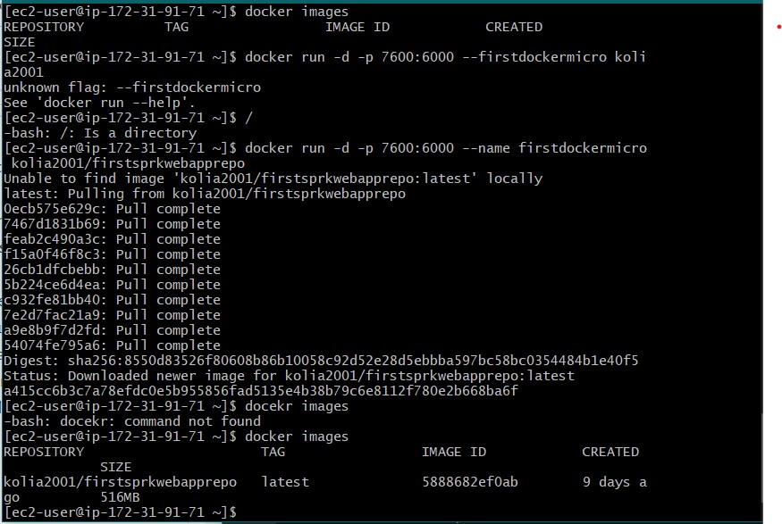

# TALLER DE DE MODULARIZACIÓN CON VIRTUALIZACIÓN E INTRODUCCIÓN A DOCKER Y A AWS

El taller consiste en crear una aplicación web pequeña usando el micro-framework 
de Spark java (http://sparkjava.com/). Una vez tengamos esta aplicación procederemos 
a construir un container para docker para la aplicación y los desplegaremos y configuraremos 
en nuestra máquina local. Luego, cerremos un repositorio en DockerHub y subiremos 
la imagen al repositorio. Finalmente, crearemos una máquina virtual de en AWS, 
instalaremos Docker , y desplegaremos el contenedor que acabamos de crear.

## Explicación y Resumen del Proyecto

Se realizará una aplicación, la cual será desplegada en AWS utilizando EC2 y Docker. El sistema de Docker tendrá cuadro micro contenedores, los cuales van a ser la aplicación web APP-LB-RoundRobin, 3 servicios REST LogService y un servicio MongoDB.
La aplicación tiene un campo y un botón , y cada vez que este se usa, se envía un mensaje al servicio REST, este servicio regresa un objeto JSON con las ultimas 10 cadenas almacenadas en la base de datos de MongoDB.

Imagen de la maquina virtual linux creada con AWS, con Docker instalado y con la primera imagen creada.

## Empezando e Instalando

Entramos a la carpeta donde queremos guardar nuestro repositorio, en este caso Desktop

`$ cd Desktop`

Clonamos el repositorio en la carpeta

`$ git clone https://github.com/Nikolas2001-13/AREP-Taller5`

Nos dirigimos a la carpeta que contiene el proyecto

`$ cd AREP-Taller5`

Compilamos con maven

`$ mvn package`

Para ejecutar la aplicación

`$ docker-compose up -d `

## Prerrequisitos
Java SE Development Kit 8 -Java SE Runtime Environment 8 -Apache Maven.
Tener conocimiento sobre Maven, GIT, Spark y GITHUB. 
Tener instalado Docker es su máquina.

## Instancia en AWS

[Amazon EC2](http://ec2-3-88-203-172.compute-1.amazonaws.com:7600/)

## Integración Continua CircleCi

## Correr las Pruebas

Para correr las pruebas del programa habrá que ejecutar el comando

`$ mvn test`

## Documentacion

Para generar la documentación habrá que ejecutar el siguiente comando

`$ mvn javadoc:javadoc`

## Construido Con

* [JUnit](https://mvnrepository.com/artifact/junit/junit) - Test framework
* [Maven](https://maven.apache.org/) - Dependency Management
* [IntelliJ](https://www.jetbrains.com/es-es/idea/) - IDE

## Autor

* **Nikolás Bernal Giraldo** - [Nikolas2001-13](https://github.com/Nikolas2001-13) - Estudiante de la Escuela Colombiana de Ingeniería Julio Gravito

## Licencia

[LICENSE.md](http://www.gnu.org/licenses/gpl.html) 
